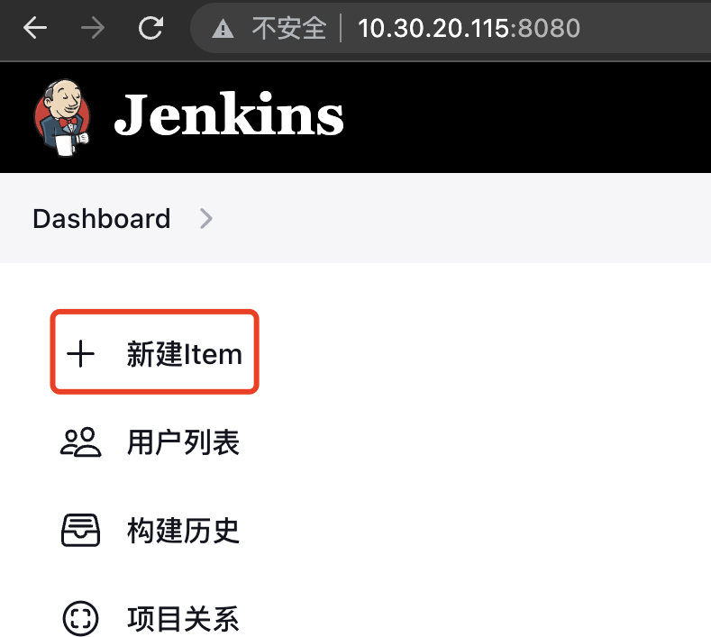
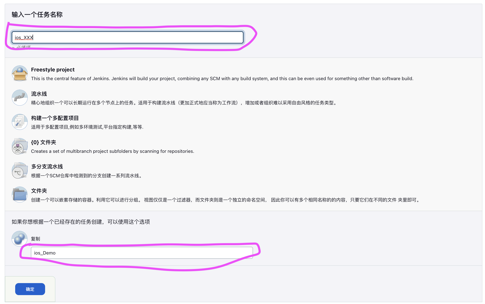
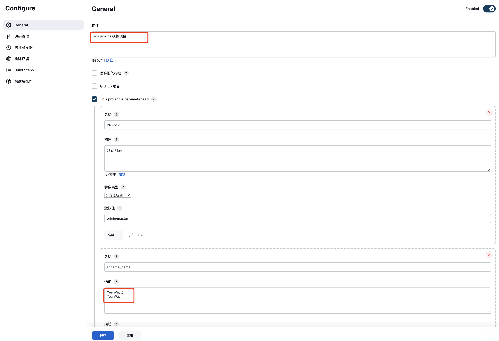
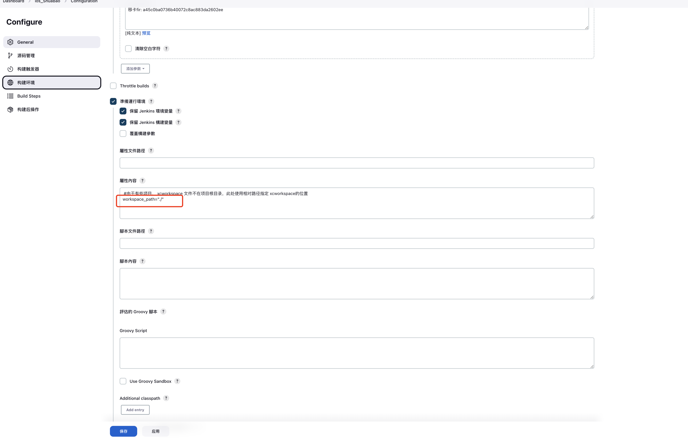
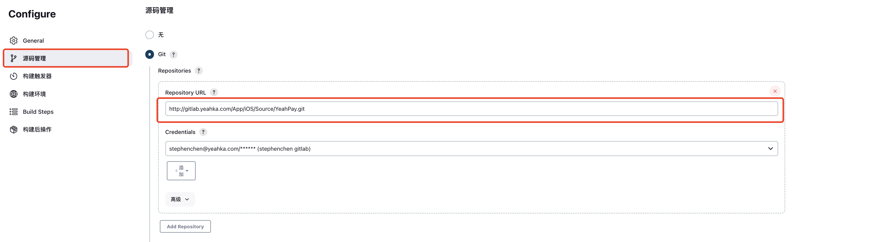
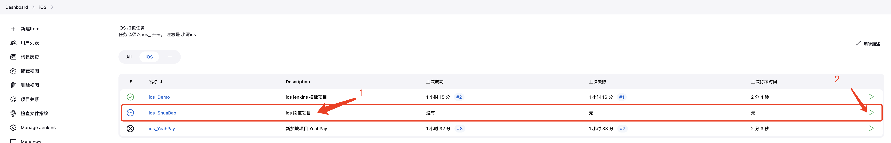
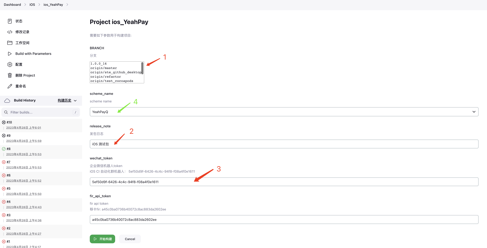

# Jenkins 部署

通过在 Jenkins 创建构建项目来实现 iOS 打包的可视化操作。Jenkins 环境已经搭建好，需要各个项目的负责人在 Jenkins 创建对应的 Jenkins 项目。

## 创建步骤

### 登录 Jenkins

Jenkins 地址: http://10.30.20.115:8080

账号/密码： admin admin

### 创建任务

Jenkins 基础环境已经部署完成，新项目可以通过复刻模板任务快速接入。

- 新建 item

  ***

  

- 命名 item

  - 输入 item 名字： ios\_
  - 选择模板： ios_Demo

    ***

    

- 配置参数

  需要改动一部分项目专有的参数：项目描述，scheme, workspcace， git 地址

  - 项目描述，scheme

    ***

    

  - workspace

    由于部分项目的 xcworkspace 文件不在 git 根目录，针对此类项目，需要额外配置 workspace_path 参数。

    ***

    

  - git 地址

    ***

    

- 保存

点击保存按钮，保存配置

## 首页视图

在 Jenkins 的首页创建了视图，可以清晰看到 iOS 项目。

## 参数化构建

Jenkins 任务是按照参数化构建的方式搭建的。在视图点击执行按钮，即可快速进入参数界面。

---

参数如下：

- 1.分支选择：用于选择打包的分支
- 2.发包日志：用于描述此次发包的目的，默认文案是： iOS 测试包
- 3.企业微信机器人：用于指定此次包用哪个企业微信机器人发通知。【建议对应业务维护一个对应的机器人】
- 4.scheme: 如果项目有多个 scheme, 且发包时候需要使用不同的 scheme，可以在这里选择。【建议把常用的 scheme 配置在第一项，发包的时候，不用选择 scheme。】

点击“开始构建”，即可触发构建任务。

> 注意：
>
> - 构建成功的时候，对应的机器人会发送包信息；
> - 如果构建失败，则会自动在企业微信 ios-ci 群发送构建失败通知。
